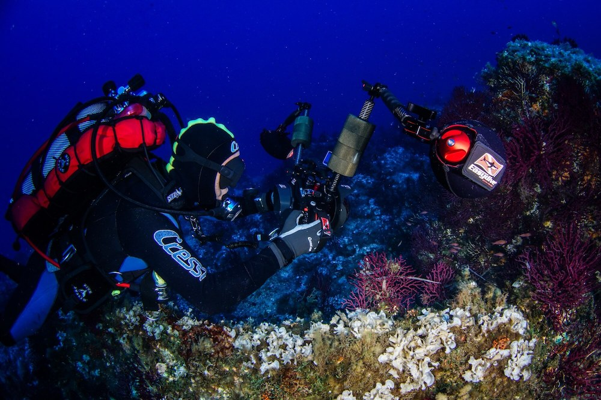

Il Club Sub Nettuno organizza una serata dedicata alla fotografia e al mondo marino, il 210 marzo 2019 alle ore 20:30 presso la saletta della Piscina Carmen Longo dello Stadio di Bologna.

[Mirko Mirabella](/didattica-fotografia-subacquea/) istruttore di fotografia presso l'Associazione Blu Cobalto e socio del Club partecipa da anni ai campionati italiani di fotografia subacquea e in questa serata ci racconterà la sua esperienza come fotografo sommozzatore e amante del mare.

La serata sarà un'occasione per avvicinarsi al mondo della fotografia e scoprirne gli aspetti tecnici.

Per chi ne avesse voglia la serata proseguirà in pizzeria.

Vi aspettiamo numerosi

