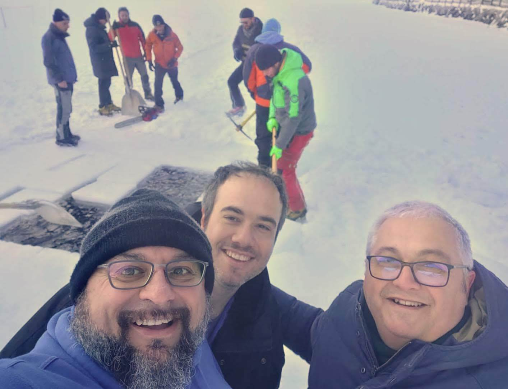
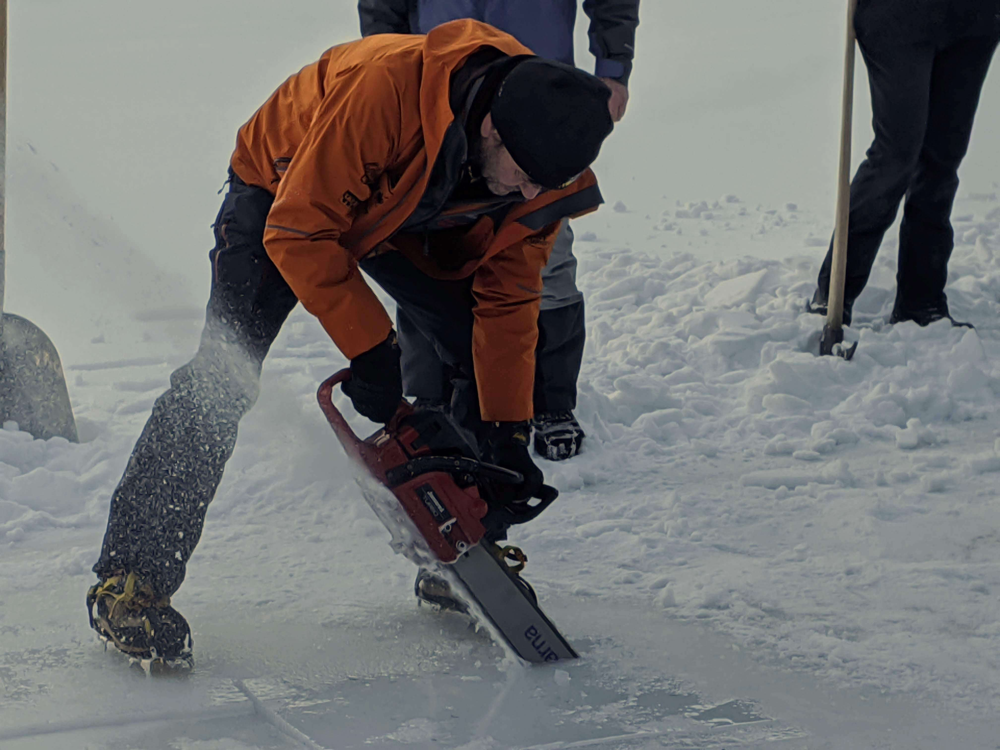
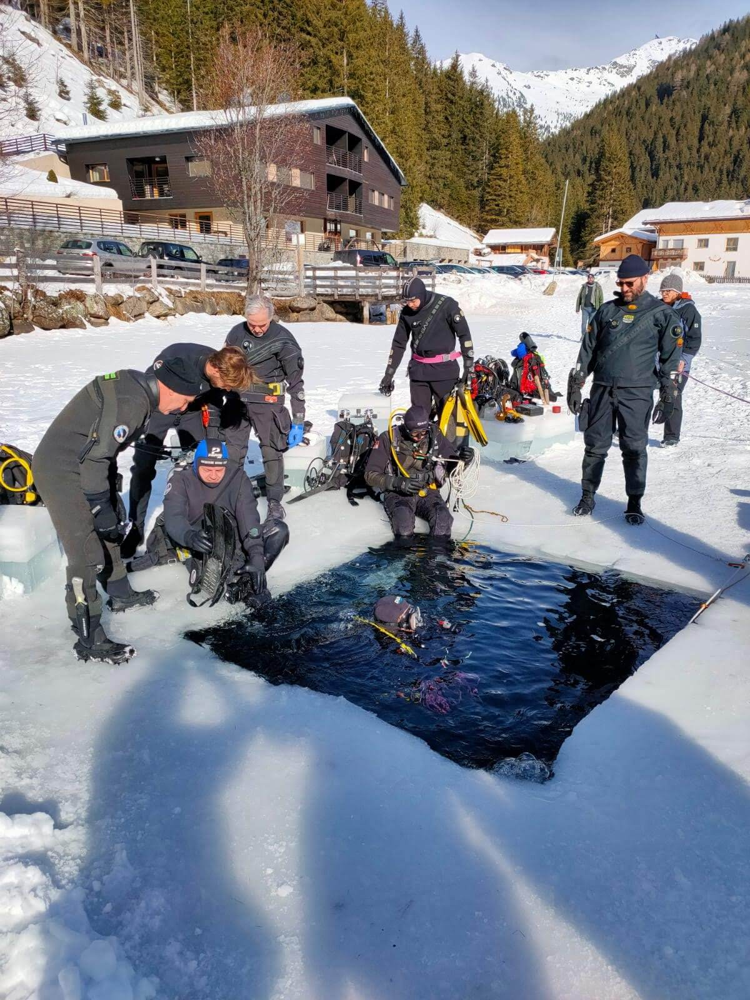
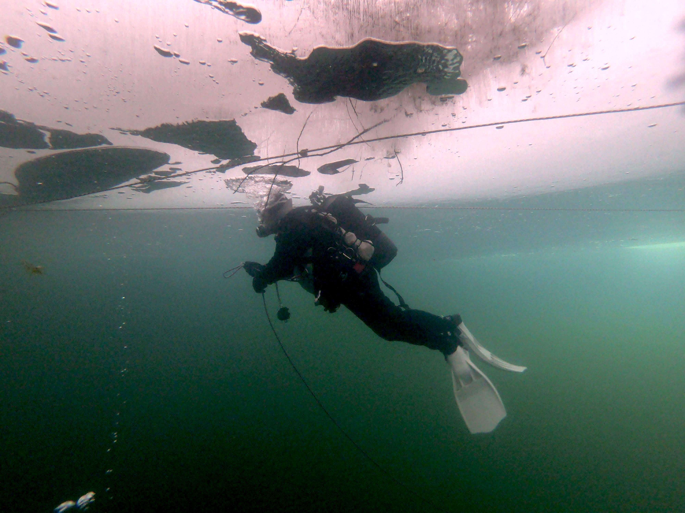
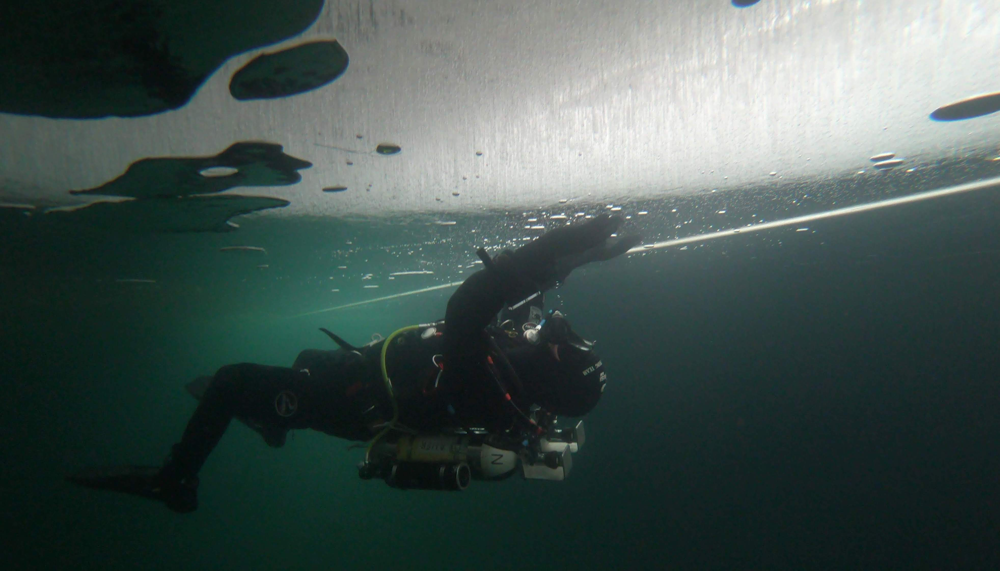

Fine settimana diverso per alcuni diver del Club Sub Nettuno, impegnati in quel di Bolzano per delle immersioni "particolari", quelle sotto i ghiacci.

Le immersioni sotto i ghiacci e in quota, richiedono un brevetto a parte, la particolarità di queste immersioni è che per farle, bisogna essere oltre i 700 metri s.l.m.

I nostri sub sono arrivati a Bolzano, venerdì pomeriggio, dove hanno partecipato ad una lezione di teoria nella sede del [Club Bolzano Sub](https://www.bzsub.it/) su immersioni in quota e immersioni sotto i ghiacci, quindi si sono spostati in piscina per mettere in pratica tutto quello che è stato spiegato poco prima.

Sabato, la sveglia si è fatta sentire presto, quindi alle 8 dopo aver fatto colazione e caricata tutta l'attrezzatura necessaria, siamo partiti per raggiungere il lago di Valdurna 1300 metri s.l.m.

Arrivati sul posto e dopo aver scaricato l'attrezzatura necessaria a poter fare i "buchi" nel ghiaccio, è entrato in azione Thomas Hoffer, rock star dei ghiacci ma anche sub, istruttore, arrampicatore, speleologo, vigile del fuoco e esperto di stufe in maiolica, che con la motosega ha aperto tre varchi nel ghiaccio ad una distanza di una ventina di metri uno dall'altro, per sicurezza opta per immersioni in linea retta.

Dopo aver messo il campo in sicurezza e dopo la vestizione, è arrivato il momento di entrare in acqua.

Si decide l'ordine e si va, si entra, la poca luce ci accoglie ed anche il freddo, il computer dice 5 gradi, ma nelle mute si sta bene, dopo qualche attimo di assestamento passa anche la strana sensazione del ghiaccio sopra alla testa e cominciamo ad andare avanti sagolati alla cima di sicurezza, fino al giro di boa e ritorno.

Il ghiaccio, visto da sotto è uno spettacolo, la luce che lo attraversa, le bolle d'aria con cui giocare, i fori che visti da lontano sembrano luci di lampioni nella notte.

Si esce, ci si cambia e si va a mangiare, il ristorante è sul lago ed offre un caldo riparo e un altrettanto caldo pasto, post immersioni.
La serata è stata trascorsa in libertà, visitando il centro storico di Bolzano per poi cenare ed andare a letto presto.

Domenica mattina Thomas ha dato appuntamento mezz'ora dopo, il grosso del lavoro è già stato fatto, ora bisogna solo riaprire i "buchi" che di notte si sono ghiacciati di nuovo, creando delle lastre
spesse 2 centimetri.

L'immersione è stata più tranquilla, l'impatto psicologico del giorno prima non si è fatto sentire, come anche la fase di acclimatamento.
Finita l'immersione, pranzo e ritorno a casa, con il ricordo di questa bellissima e interessantissima esperienza.
